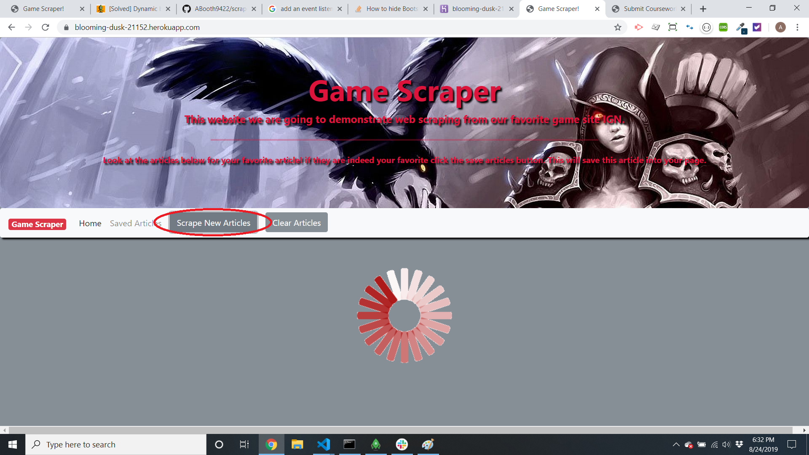
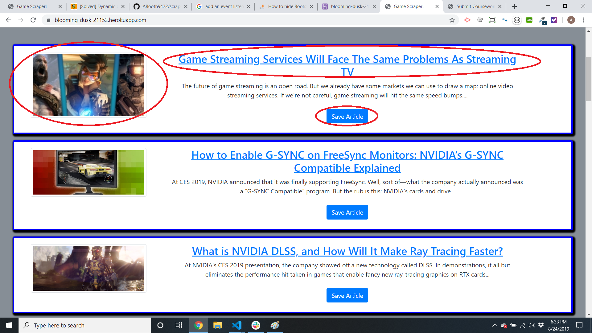
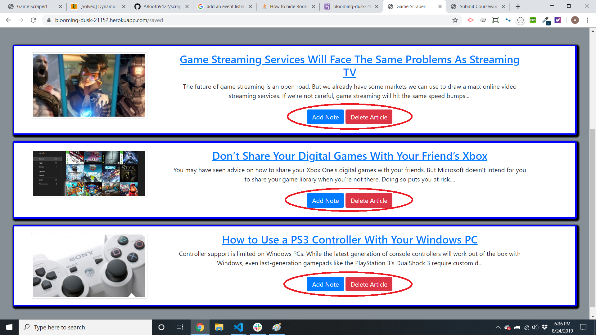
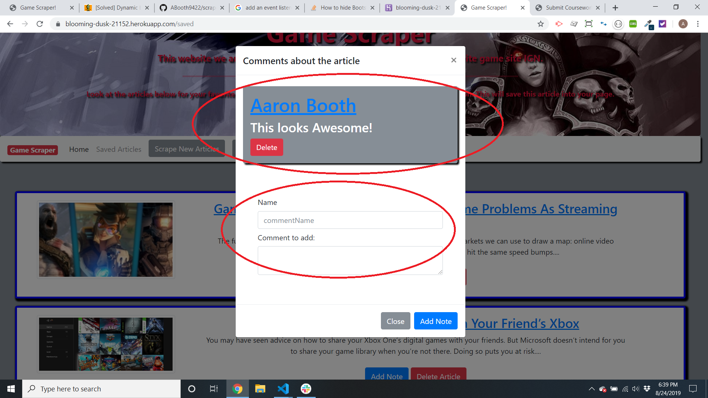

<h1 align="center">Welcome to GameScraper   👋</h1>
<p>
  
  <a href="https://github.com/ABooth9422/scraper#readme">
    
  </a>
  <a href="https://github.com/ABooth9422/scraper/graphs/commit-activity">
    
  </a>
</p>

### 🏠 [Homepage](https://github.com/ABooth9422/scraper#readme)

## Description
The purpose of this project is to demonstrate a full-stack application with the incorporation of mongodb. This application is hosted on heroku. The goal of the project was to scrape a website and to return a list of articles. Upon getting the list of articles you could then save the article. When you navigate to the saved articles you have the oppertunity to leave a comment about what you thought about the article.

Technologies used:
<ul>
 <li>Heroku</li>
 <li>Mongodb</li>
 <li>Mongoose</li>
 <li>Handlebars</li>
 <li>Express</li>
</ul>

## Lets get scrapin!
When you first load the page you will need to click the button scrape new articles to get a list of the articles that we have scraped from the page.




After you do the initial scrape you will see a thumbnail image of the article. The article title which is also a link to the real-time article and a button to save the article to your saved paged.




## Saved Articles
After you visit the initial scrape and you've saved some articles they will all appear in this portion of the website!
You will notice from the picture that now that you have entered the saved articles page you can either add a note about the article or delete the article from your saved articles.




## Comments
When your leaving a comment a modal will pop up and show you all the current comments on the article! Leave your name and the comment you would like to write so that all of the users can read it. If you want to delete the comment you may do so by clicking the delete button.


## Clear

To get rid of all the results that you have scraped you can hit the clear articles button and it will remove all articles from the page.

## Usage

```sh
node server.js  
```

## Author

👤 **Aaron Booth  **

* Github: [@ABooth9422](https://github.com/ABooth9422)

## 🤝 Contributing

Contributions, issues and feature requests are welcome!<br />Feel free to check [issues page](https://github.com/ABooth9422/scraper/issues).

## Show your support

Give a ⭐️ if this project helped you!

***
_This README was generated with ❤️ by [readme-md-generator](https://github.com/kefranabg/readme-md-generator)_